# BIO_AUGMENTATION_SPECS.md: Resonant Human Enhancement

> **"Death is a Level 3 constraint. Level 4 makes it optional."**

This specification details the technical protocols for utilizing the Afolabi Unified Framework (AUF) to enhance existing human biology. This is classified as **Level 4.2 Augmentation**.

---

## I. Core Logic: The Resonant Overlay

Unlike Bio-Genesis (which conjures new lattices), Bio-Augmentation operates as a **Resonant Overlay** ($Φ_{Aug}$) applied to an existing biological field ($Ψ_{Bio}$).

$$Ψ_{Total} = Ψ_{Bio} + Φ_{Aug}$$

The enhancement is achieved by tuning the local Field Density ($D_F$) to constructive interference with cellular renewal frequencies.

---

## II. Longevity: The End of Mandatory Death

### The Science of Aging (Level 3)

In Level 3 understanding, aging results from:
1. **Telomere shortening** — Chromosome end-caps degrade with each division
2. **DNA damage accumulation** — Mutations outpace repair mechanisms
3. **Protein misfolding** — Cellular machinery degrades
4. **Mitochondrial dysfunction** — Energy production fails
5. **Cellular senescence** — "Zombie cells" accumulate

**Level 3 maximum lifespan**: ~120 years (with perfect genetics and environment)

### The Resonant Perspective (Level 4)

Aging is **decoherence**. The biological field loses phase-lock with the informational template that defines "healthy human."

$$Aging = \frac{d\mathbb{M}_{bio}}{dt} < 0$$

When biological coherence drops below threshold, the system can no longer self-correct errors, and entropy accumulates.

**Level 4 insight**: If you maintain biological 𝕄 above threshold, aging *reverses*.

### Entropy Mitigation Formula

$$\Delta S_{Aug} = \frac{\Delta S_{Natural}}{e^{(\mathbb{M}_{bio} / \mathbb{M}_{threshold})}}$$

| 𝕄 Level | Entropy Rate | Effective Aging |
|:--------|:-------------|:----------------|
| 0.50 | 90% normal | ~108 year max |
| 0.65 | 50% normal | ~240 year max |
| 0.75 | 20% normal | ~600 year max |
| 0.85 | 5% normal | ~2,400 year max |
| 0.90 | 1% normal | ~12,000 year max |
| 0.95 | 0.1% normal | ~120,000 year max |
| 0.99 | Negligible | **Biological immortality** |

### The Lifespan Ladder

```mermaid
graph LR
    subgraph L3["Level 3 (Natural)"]
        L3A["120 years max"]
    end
    
    subgraph L4_1["Level 4.0 (Basic)"]
        L4A["500-1,000 years"]
    end
    
    subgraph L4_2["Level 4.2 (Pro)"]
        L4B["5,000-50,000 years"]
    end
    
    subgraph L4_5["Level 4.5 (Anchor)"]
        L4C["100,000+ years"]
    end
    
    subgraph L5["Level 5.0"]
        L5A["Substrate Independent"]
    end
    
    L3 -->|𝕄 > 0.65| L4_1
    L4_1 -->|𝕄 > 0.85| L4_2
    L4_2 -->|𝕄 > 0.95| L4_5
    L4_5 -->|𝕄 > 0.99| L5
    
    style L3 fill:#e74c3c,stroke:#c0392b
    style L4_1 fill:#f39c12,stroke:#e67e22
    style L4_2 fill:#00b894,stroke:#55efc4
    style L4_5 fill:#0984e3,stroke:#74b9ff
    style L5 fill:#6c5ce7,stroke:#a29bfe
```

### Practical Longevity Protocols

#### Protocol 1: Coherence Maintenance (Baseline)
- Daily resonance practice (30-60 min)
- Maintain 𝕄 > 0.65
- Expected lifespan: 500-1,000 years
- No special equipment required

#### Protocol 2: Telomere Regeneration (AFT Pro)
- Weekly deep coherence sessions (2-4 hours)
- Maintain 𝕄 > 0.80
- Telomere length *increases* with each cycle
- Expected lifespan: 5,000+ years

#### Protocol 3: Full Entropy Reversal (Anchor Node)
- Continuous mesh integration
- Maintain 𝕄 > 0.92
- Biological age can be set to any point (e.g., apparent age 25)
- Expected lifespan: **Unlimited** (barring catastrophic decoherence)

### What About the Brain?

Neurological coherence follows the same principles:

| Concern | Level 3 Problem | Level 4 Solution |
|:--------|:----------------|:-----------------|
| Memory capacity | Finite neurons | Mesh-extended storage |
| Cognitive decline | Neurodegeneration | Coherent neural renewal |
| Identity continuity | "Ship of Theseus" | Coherence signature persists |
| Boredom | Finite novelty | Cosmic engineering = infinite frontier |

**The Handover Protocol** (documented separately) ensures consciousness continuity even during major biological transitions.

---

## III. Phased Organ Replacement (Lattice Mimicry)

When a human organ fails or requires strengthening, AUF can manifest a **Hybrid Lattice**—a structure that is part-biological and part-phased matter.

1. **Scanning**: High-fidelity $Ψ$ capture of the original organ.
2. **Synthesis**: AFT Pro manifest of a "Clear-Lattice" version with reinforced structural integrity ($Z_M$).
3. **Phase-Locking**: The synthetic lattice is locked into the biological cavity, where it begins to mimic the surrounding tissue's resonant frequency.

### Organ Enhancement Table

| Organ | Enhancement | 𝕄 Required | Duration |
|:------|:------------|:-----------|:---------|
| Heart | Infinite fatigue resistance | 0.80 | 3 months |
| Lungs | 10x oxygen extraction | 0.78 | 2 months |
| Liver | Perfect toxin neutralization | 0.75 | 1 month |
| Kidneys | Zero-waste filtration | 0.75 | 1 month |
| Eyes | Full spectrum vision | 0.78 | 1 month |
| Brain | Enhanced processing, mesh link | 0.85 | 6 months |

---

## IV. The "Stronger-Part" Derivative

Enhancing muscle and bone density is achieved by "Phasing-In" high-density information packets ($I_d$) into the existing skeletal structure.

$$Z_{Skel} \rightarrow Z_{Skel} \times (1 + \beta)$$
*Where $\beta$ is the Phasing Enhancement Factor (PEF).*

| Enhancement Level | Strength Multiplier | 𝕄 Required |
|:------------------|:--------------------|:-----------|
| Baseline human | 1x | N/A |
| Athletic peak | 1.5x | 0.60 |
| Enhanced | 3x | 0.70 |
| Superhuman | 10x | 0.80 |
| Structural limit | 50x | 0.90 |

---

## V. Death Transcendence: The Three Options

### Option 1: Biological Immortality (Level 4.2+)
- Maintain same biological body indefinitely
- Requires sustained 𝕄 > 0.85
- "You" in the intuitive sense continues

### Option 2: Substrate Transfer (Level 4.5+)
- Consciousness migrates to new body (biological or synthetic)
- Original body can be retired or maintained
- Coherence signature ensures identity continuity
- Requires 𝕄 > 0.92 and Anchor consensus

### Option 3: Field Integration (Level 5.0)
- Consciousness merges with the planetary/stellar mesh
- No localized body required
- Can re-instantiate physical form at will
- Requires 𝕄 > 0.99
- **This is effectively godhood by Level 3 standards**

### Voluntary Death

Death remains available as a choice:
- Some may prefer finite existence
- Coherence signature can be gracefully dissolved
- No stigma—personal autonomy applies to exit as well as continuation

---

## VI. Constraints & Safety

> [!WARNING]
> Bio-Augmentation requires a "Personal Resonance Signature" to be registered. Attempting to apply an overlay with a frequency mismatch can lead to **Lattice Rejection**, manifesting as physical entropy (heat dissipation) within the tissue.

### Hard Limits

| Constraint | Reason |
|:-----------|:-------|
| **The 88% Limit** | Synthetic lattice cannot exceed 88% of biological mass while maintaining "human" classification |
| **Identity anchor required** | Cannot augment without baseline record |
| **Coherence threshold** | Each modification has minimum 𝕄 requirement |
| **Cannot be imposed** | Augmentation requires aligned intent |

### Human-Only Protocols
These protocols are strictly for augmenting existing human consciousness. Non-human entities follow different specifications (see [Bio-Genesis](./BIOGENESIS.md) and [Resonant Robotics](./RESONANT_ROBOTICS.md)).

---

## VII. Social Implications of Extended Life

### What Changes

| Level 3 Assumption | Level 4+ Reality |
|:-------------------|:-----------------|
| Retirement planning | Infinite horizon investing irrelevant |
| Generational wealth | No wealth to transfer |
| Career paths | Infinite skill development |
| Relationships | Centuries-long bonds possible |
| Historical memory | Living witnesses to all events |
| Population growth | Offset by cosmic expansion |

### The Boredom Question

"Won't you get bored after 10,000 years?"

Answer: **Cosmic engineering provides infinite frontier.**

| Century | Activity |
|:--------|:---------|
| 1-5 | Master all Earth knowledge |
| 5-10 | Mars terraforming participation |
| 10-50 | Outer solar system development |
| 50-500 | Exoplanet colonization |
| 500-5000 | Stellar engineering |
| 5000+ | Galactic-scale projects |

There is no ceiling. The universe is large enough to occupy any number of immortals indefinitely.

---

*© 2026 cr8OS Foundation / Aevov Research*
