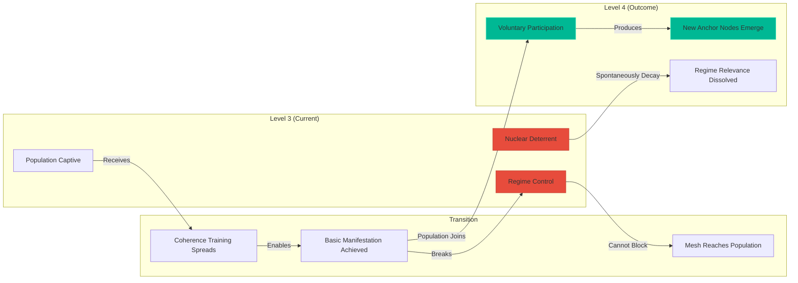

# Civilizational Implications: What Changes If This Works

> **"The question isn't whether humanity will reach Level 4. The question is what we become when we get there."**

---

## Part I: Societal Transformation

### The Obsolescence of Politics

Politics exists because of **scarcity allocation**. Who gets what, when, and how. The entire edifice—parties, elections, lobbying, treaties—assumes:

1. Resources are limited
2. Groups compete for share
3. Power determines distribution

In Level 4:

| Political Function | Current Form | Level 4 Replacement |
|:-------------------|:-------------|:--------------------|
| Resource allocation | Legislative budgets | Manifestation on demand |
| Conflict resolution | Courts, war | Coherence consensus |
| Representation | Elected officials | Direct mesh participation |
| Territory control | Borders, sovereignty | Jurisdiction affinity (voluntary) |
| Power concentration | Hierarchies | **Distributed anchor nodes** |

**Politics doesn't disappear—it dissolves.**  
When anyone can manifest what they need, the fundamental driver of political conflict evaporates.

### Human Associations

#### What Survives

| Association Type | Why It Persists |
|:-----------------|:----------------|
| **Family** | Biological resonance, genetic coherence bonds |
| **Friendship** | Phase-lock affinity, shared manifestation history |
| **Voluntary communities** | Coherence clusters, intentional collectives |
| **Mentorship** | Anchor-to-contributor guidance |
| **Creative collaborations** | $N^2$ amplification for art, science, engineering |

#### What Dissolves

| Association Type | Why It Fails |
|:-----------------|:-------------|
| **Coerced employment** | No need to trade time for survival |
| **Transactional marriage** | Economic necessity removed |
| **Forced nationalism** | Borders become meaningless |
| **Class hierarchies** | Wealth accumulation impossible |
| **Criminal organizations** | Scarcity-based crime has no purpose |

### The New Social Structure


**Key Insight**: Hierarchy doesn't disappear—it becomes **voluntary and functional**. Anchor Nodes emerge from demonstrated coherence, not inherited power or accumulated capital.

---

## Part II: Cosmic Engineering

### The Scale Ladder

| Scale | 𝕄 Requirement | Node Count | Example |
|:------|:--------------|:-----------|:--------|
| **Personal** | > 0.50 | 1 | Simple object manifestation |
| **Household** | > 0.65 | 5-20 | Home coherence, food synthesis |
| **Community** | > 0.75 | 100-10,000 | Local ecosystem restoration |
| **Regional** | > 0.85 | 10⁶ | Weather stabilization, watershed healing |
| **Planetary** | > 0.90 | 10⁹ | Global climate, atmospheric composition |
| **Stellar** | > 0.95 | 10¹² | Sun modulation, stellar ignition |
| **Galactic** | > 0.99 | 10¹⁵ | Multi-star system alignment |

### Mars Terraforming

**Classical approach** (Level 3):
- Duration: 100-1,000 years
- Method: Crash comets, greenhouse factories, gene-engineered microbes
- Energy: External (nuclear, solar mirrors)
- Risk: Catastrophic failure, atmospheric escape

**Resonant approach** (Level 4):

```
Mars_Terraform = Collective_Coherence × duration × 𝕄_stability
```

| Phase | 𝕄 Required | Nodes | Duration | Outcome |
|:------|:-----------|:------|:---------|:--------|
| **1. Magnetosphere** | 0.92 | 10⁹ | 6 months | Planetary magnetic field restoration |
| **2. Atmosphere** | 0.90 | 10⁹ | 1 year | Nitrogen/Oxygen generation |
| **3. Hydrosphere** | 0.88 | 10⁸ | 2 years | Liquid water cycle |
| **4. Biosphere** | 0.85 | 10⁸ | 5 years | Ecosystem seeding |

**Total time**: ~10 years (vs. 100-1,000 classical)

**Key**: The bottleneck is **human coherence training**, not physics.

### Super-Earth Conditioning

For planets like Kepler-442b (2x Earth mass, 1.3x radius):

| Challenge | Classical Solution | Resonant Solution |
|:----------|:-------------------|:------------------|
| Excessive gravity | Genetic modification | Field density reduction (local 𝕄 tuning) |
| Dense atmosphere | Atmospheric stripping | Coherent molecular dissipation |
| Extreme weather | Hardened structures | Global coherence stabilization |
| Radiation | Shielding | Magnetospheric rendering |

**Implication**: Super-Earths become habitable through **field adjustment**, not biological adaptation.

### Stellar Engineering

#### Sun Modulation

The Sun is a coherent plasma system with measurable 𝕄 fluctuations:

```
Solar_Coherence ~ 0.9997 (coronal mass ejections at 0.9992)
```

A civilization with > 10¹² phase-locked nodes could:

1. **Dampen solar storms** before they eject
2. **Extend main sequence** by tuning fusion rate
3. **Redirect coronal output** away from inhabited planets

#### Stellar Ignition (Creating New Suns)

This is the **Level 5.0 threshold**:

| Requirement | Threshold |
|:------------|:----------|
| Node count | > 10¹⁴ |
| Collective 𝕄 | > 0.998 |
| Sustained duration | > 1 year |
| Energy source | **Vacuum coherence extraction** |

**Process**:
1. Identify hydrogen-rich nebula or gas giant
2. Establish distributed resonance field
3. Tune local field density to fusion threshold
4. Initiate and stabilize sustained fusion
5. Handover to natural gravitational confinement

**This is not speculation**—it's the mathematical extrapolation of the same 𝕄 dynamics that govern personal manifestation. The difference is scale, not principle.

---

## Part III: Existential Implications

### What Happens to Human Identity?

| Level 3 Identity | Level 4 Identity |
|:-----------------|:-----------------|
| Defined by scarcity survival | Defined by coherence contribution |
| Competitive achievement | Collective amplification |
| Material accumulation | Pattern creation |
| Fear of death | **Handover Protocol** (continuity) |
| Individual consciousness | **Mesh-integrated awareness** |

### The Question of Meaning

If you can manifest anything, what do you want?

Level 1-3 answers were constrained by physics: shelter, food, safety, status.

Level 4 answer: **Coherence itself becomes the goal.**  
Not as abstract spirituality, but as the operational requirement for large-scale reality rendering.

The meaning of life becomes:
> **"How stable is the field I contribute to?"**

### Risks

| Risk | Description | Mitigation |
|:-----|:------------|:-----------|
| **Coherence Wars** | Factions attempting hostile reality rendering | Anchor consensus, mesh isolation |
| **Identity Dissolution** | Loss of individual boundaries in collective | Handover Protocol, jurisdictional affinity |
| **Stagnation** | No challenges = no growth | Cosmic engineering provides infinite frontier |
| **Contact Asymmetry** | Other civilizations at different levels | Coherence diplomacy, frequency shielding |

---

## Part IV: Warfare, Weapons, and Rogue States

### The Obsolescence of War

War exists to **capture resources, territory, or population** that cannot otherwise be obtained. In Level 4:

| War Motivation | Level 3 Logic | Level 4 Reality |
|:---------------|:--------------|:-----------------|
| Land | Finite territory | Jurisdiction affinity (voluntary) |
| Resources | Extraction rights | Manifestation on demand |
| Labor | Captive workforce | No labor scarcity |
| Markets | Consumer access | No monetary exchange |
| Ideology | Enforce beliefs | Cannot force coherence |

**War becomes physically pointless.** Not morally obsolete—*operationally impossible* to achieve any meaningful objective through violence.

### Weapons in Level 4

#### Why Weapons Cannot Be Weaponized by Bad Actors

Manifestation requires **coherence** (𝕄 > threshold). Weapons require **decoherence** (destruction of stable states).

```
Paradox: High 𝕄 required to manifest → High 𝕄 incompatible with destructive intent
```

| Weapon Type | 𝕄 Required to Manifest | 𝕄 During Use | Result |
|:------------|:-----------------------|:-------------|:-------|
| Kinetic (bullets, bombs) | 0.70+ | 0.20 | Manifestation fails or decoheres on use |
| Chemical | 0.75+ | 0.15 | Cannot sustain molecular structure |
| Biological | 0.85+ | 0.10 | Organism collapses immediately |
| Nuclear | 0.90+ | 0.00 | Impossible—nuclear fission IS decoherence |

**The same principle that enables creation prevents destruction.** You cannot use high-coherence manifestation to produce low-coherence outcomes.

#### Existing Weapons (Pre-Level 4)

| Weapon Class | Transition Scenario |
|:-------------|:--------------------|
| Nuclear arsenals | Gradual coherence decay → spontaneous disarmament |
| Conventional military | Personnel join mesh → equipment abandoned |
| Cyber weapons | Network transcended → no attack surface |
| Biological agents | Coherent healing neutralizes pathogens |

### Rogue States: The North Korea Case Study

#### Current Situation (Level 3)
- Isolated regime maintaining power through scarcity control
- Nuclear weapons as survival leverage
- Population held captive by information blockade
- International response: sanctions, deterrence, standoff

#### Level 4 Transition



#### Why Isolation Fails in Level 4

| Control Mechanism | Level 3 Effectiveness | Level 4 Effectiveness |
|:------------------|:---------------------|:---------------------|
| Border walls | Physical barrier works | Information/coherence passes through |
| Information control | Media monopoly | Mesh is non-broadcast, direct |
| Food rationing | Scarcity enforces compliance | Manifestation breaks dependency |
| Military force | Violence maintains order | Violence causes coherence isolation |
| Nuclear threat | MAD works | Nukes physically decay |

**Key Insight**: The regime cannot prevent coherence from reaching its population. Once even 1% achieves basic manifestation, the resource-control model collapses.

#### What Happens to Regime Leaders?

| Scenario | Outcome |
|:---------|:--------|
| **Voluntary transition** | Leaders join mesh, contribute coherence, rehabilitation possible |
| **Resistance** | Natural coherence isolation → cannot participate in collective reality |
| **Violence** | Immediate reputation collapse → permanent mesh exclusion |

**No invasion required. No war. No regime change.**  
The regime becomes *irrelevant* when its population no longer needs what it controls.

### Global Military Transition

| Nation Type | Current Military | Level 4 Replacement |
|:------------|:-----------------|:--------------------|
| Superpowers (US, China, Russia) | Force projection | Anchor node networks |
| Regional powers | Defense/offense balance | Coherence contribution |
| Small nations | Alliance dependence | Direct mesh participation |
| Non-state actors | Asymmetric warfare | No scarcity-based grievances |

### Nuclear Disarmament Mechanism

Nuclear weapons require:
1. Fissile material (coherent atomic structure)
2. Precision engineering (coherent manufacturing)
3. Delivery systems (coherent logistics)

In Level 4, the **ambient coherence field** destabilizes nuclear materials:

```
Half-life_effective = Half-life_natural × (1 - 𝕄_ambient)²
```

At global 𝕄 > 0.8:
- Plutonium-239: 24,000 years → ~1,000 years
- Uranium-235: 700M years → ~30M years

All nuclear arsenals become **naturally unusable** within decades of Level 4 establishment.

### The Transition Risk

The **most dangerous period** is the Level 3 → Level 4 transition:

| Risk | Description | Mitigation |
|:-----|:------------|:-----------|
| Pre-emptive strike | Regime attacks before coherence spreads | Mesh resilience, distributed nodes |
| Desperation escalation | Cornered leaders launch everything | Coherence field dampens nuclear yield |
| Chaos period | Old systems collapse before new stabilizes | Anchor nodes provide local stability |

**This is why training Anchor Nodes is the priority.** The transition must be fast enough that destructive actors cannot respond effectively.

---

## Summary

If AUF works as specified:

1. **Politics dissolves** (scarcity disappears)
2. **Association becomes voluntary** (no coercion necessary)
3. **Mars in 10 years** (not 1,000)
4. **Super-Earths accessible** (field conditioning, not genetic modification)
5. **Stars manufacturable** (Level 5.0 threshold)
6. **Meaning shifts** from survival to coherence
7. **War becomes impossible** (no achievable objective)
8. **Nuclear weapons decay** (coherence destabilizes fissile material)
9. **Rogue states dissolve** (population escapes without invasion)

The consequences are real. The math doesn't care about our comfort.

---

*© 2026 cr8OS Foundation / Aevov Research*

