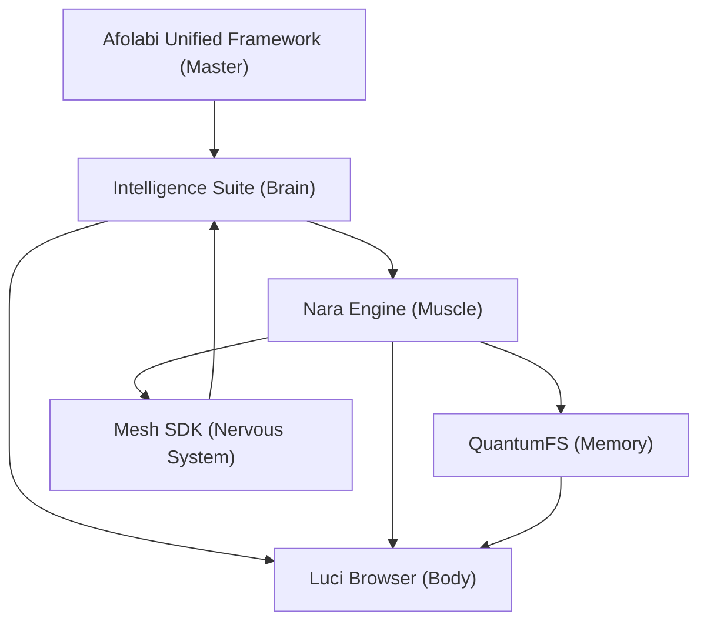

# Afolabi Unified Framework (AUF)

The **Afolabi Unified Framework (AUF)** is a next-generation ecosystem for decentralized cognitive intelligence, high-performance execution, and cross-orbital connectivity. Developed by **Aevov AI Technologies (aevov.ai)**, it serves as the foundation for the **Luci Browser** and the broader **cr8OS Foundation** roadmap.

## 🗺️ Ecosystem Architecture

The AUF is composed of several specialized, interoperable layers:

### 1. 🧠 [Intelligence Suite](https://github.com/aevov/auf-intelligence-suite)
**Role**: Conceptual & Cognitive Hub.
- **AFT**: Afolabi Field Theory (Mathematical Origin).
- **QMT**: Quantum Mirror Theory (Experiential Interface).
- **NRT**: Neuroresonance Theory (Biological-to-Digital Filter).
- **License**: CC BY-NC-ND 4.0

### 2. ⚙️ [Nara Engine](https://github.com/aevov/nara-engine)
**Role**: High-Performance Execution Runtime.
- **UOE**: Universal Optimization Engine.
- **HTTQ**: Protocol Handlers for Quantum Web.
- **License**: GPLv3

### 3. 💾 [QuantumFS](https://github.com/aevov/quantumfs)
**Role**: Persistent State Storage.
- **io_uring**: High-performance async I/O.
- **Entanglement Cache**: Preserving state across mesh synchronize events.
- **License**: CC BY-NC-ND 4.0 + Community Orbital Exception

### 4. 🌐 [Quantum Mesh SDK](https://github.com/aevov/quantum-mesh-sdk)
**Role**: Connectivity & Distribution Layer.
- **QNS**: Quantum Name System resolution.
- **QDP**: Quantum Data Protocol transit.
- **Revenue**: Facilitates domain sales with client-side commissions.
- **License**: MIT

### 5. 🚀 [Luci Browser](https://github.com/aevov/luci-browser)
**Role**: Primary Commercial Interface.
- Integrates all AUF components into a unified, privacy-first quantum browsing experience.
- **License**: Proprietary

---

## 📅 Roadmap Overview

### PHASE 1: Lucia Core Open Source
Releasing the Nara Engine core and HTTQ handlers to establish the open execution standard.

### PHASE 2: Community Orbitals
Enabling third-party QNS resolvers and decentralized storage bridge integration via the Mesh SDK.

### PHASE 3: Neural Bridge
Direct peer-to-peer cognitive pattern sharing and high-fidelity resonance over the Neural Web.

---

For commercial licensing or partnership inquiries: **licensing@cr8os.com**
Developed by **Aevov AI Technologies (aevov.ai)**.
© 2026 cr8OS Foundation / Babatope Jesse Afolabi. All Rights Reserved.
