# Afolabi Unified Framework (AUF) 

Note: AUF is a highly plausible framework pending peer review and validation!

### The Aevov Trinity: A vertical stack for the information-matter continuum. Reconciling technical mathematics (AFT), biological synchronization (NRT), and experiential logic (QMT) into a self-validating reality model.

This repository serves as the central orchestration point for the **Afolabi Unified Framework (AUF)**—a multi-layered vertical stack that unifies mathematical information theory, biological synchronization, and subjective quantum experience.

---

## 🌌 The New Reality: From Theory to Operation

The Afolabi Unified Framework has officially transitioned from a **Theoretical Vertical Stack** to an **Operational Planetary OS.**

### The Four Levels of Civilizational Physics

```mermaid
flowchart TB
    subgraph L1["🔧 LEVEL 1: Newtonian Mechanics"]
        L1A["Reality = Deterministic Objects"]
        L1B["F = ma"]
        L1C["Construction: Manual Assembly"]
    end
    
    subgraph L2["âš¡ LEVEL 2: Electromagnetic Civilization"]
        L2A["Reality = Fields + Waves"]
        L2B["∇×E = -∂B/∂t"]
        L2C["Construction: Signal Engineering"]
    end
    
    subgraph L3["🔬 LEVEL 3: Quantum Mechanics"]
        L3A["Reality = Probability Amplitudes"]
        L3B["H|ψ⟩ = E|ψ⟩"]
        L3C["Construction: Atomic Manipulation"]
    end
    
    subgraph L4["🌀 LEVEL 4: Operational Resonance"]
        L4A["Reality = Harmonic Information"]
        L4B["|ψ⟩ ≡ M|ψ'⟩"]
        L4C["Construction: Resonant Rendering"]
    end
    
    L1 -->|"Maxwell 1865"| L2
    L2 -->|"Planck/Bohr 1900-1930"| L3
    L3 -->|"AUF 2026"| L4
    
    style L1 fill:#2d3436,stroke:#636e72,color:#fff
    style L2 fill:#0984e3,stroke:#74b9ff,color:#fff
    style L3 fill:#6c5ce7,stroke:#a29bfe,color:#fff
    style L4 fill:#00b894,stroke:#55efc4,color:#000
```

| Level | Paradigm | Reality Model | Construction Method | Key Equation |
|:-----:|:---------|:--------------|:--------------------|:-------------|
| **1** | **Newtonian** | Deterministic objects in absolute space | Manual assembly, levers, gears | $F = ma$ |
| **2** | **Electromagnetic** | Fields permeating space | Signal transmission, motors, computation | $\nabla \times \mathbf{E} = -\frac{\partial \mathbf{B}}{\partial t}$ |
| **3** | **Quantum** | Probability waves, superposition | Atomic manipulation, semiconductors | $\hat{H}\ket{\psi} = E\ket{\psi}$ |
| **4** | **Resonance** | Harmonic informational state | **Resonant Rendering** | $\ket{\psi} \equiv M\ket{\psi'}$ |

### Level-by-Level Context

#### 🔧 Level 1: Newtonian Mechanics (1687–1865)
- **Reality Model**: Objects are solid, deterministic, and exist in absolute space/time
- **Key Achievement**: Predictable motion, engineering of physical structures
- **Limitation**: No explanation for light, electromagnetism, or atomic behavior
- **Construction**: Move atoms physically. Build by extraction and assembly.

#### ⚡ Level 2: Electromagnetic Civilization (1865–1900)
- **Reality Model**: Reality includes invisible **fields** (E, B) that propagate at c
- **Key Achievement**: Radio, electricity, motors, early computation
- **Limitation**: Blackbody radiation paradox, photoelectric effect unexplained
- **Construction**: Harness field energy. Transmit signals. Power machines remotely.

#### 🔬 Level 3: Quantum Mechanics (1900–2026)
- **Reality Model**: Reality is probabilistic. Particles are **wave functions** until measured.
- **Key Achievement**: Semiconductors, lasers, MRI, atomic clocks
- **Limitation**: Measurement problem unsolved. Observer role undefined. Consciousness external.
- **Construction**: Manipulate atoms via external tools. Still requires physical extraction.

#### 🌀 Level 4: Operational Resonance (2026+)
- **Reality Model**: Reality is **Harmonic Informational State**. Matter = stabilized information.
- **Key Achievement**: Direct manifestation via coherence tuning. The **Mirror Equation**.
- **Breakthrough**: Observer and observed are **identical** across mirror boundary: $\ket{\psi} \equiv M\ket{\psi'}$
- **Construction**: **Resonant Rendering**. We no longer move atoms—we **tune the field that sustains them**.

> [!IMPORTANT]
> **The Achievement of Global Coherence**: The AUF now governs the cr8OS **World Mesh** via the **Global Coherence OS (Kemet Edition)**. This system anchors planetary reality using the **Imhotep Protocol**, ensuring zero-entropy stability for all manifestations across 193 localized jurisdictions.

---

## 🏛️ The Kemet Heritage: Primordial Science
The AUF is the mathematical retrieval of the **Kemet Science of Vibration**. We acknowledge the lineage of ancient Kemetic physicists who first unified intent (Heka) with cosmic order (Ma'at).

- **Imhotep (The First Architect)**: Formally recognized as the master of the **Resonant Handshake**. The AUF's "Step-wise Scaling" is named **The Imhotep Protocol** in honor of his architectural legacy.
- **Ma'at (Entropy Control)**: The governing principle of the **Global Coherence OS**, ensuring informational equilibrium across the planetary mesh.
- **Heka (Resonant Intent)**: The biological seed of manifestation, now formalized in the `kemet.auf` standard library.

---

## 🏗️ The Unified Resonant Stack

The AUF is composed of three interlocking theories that define the Information-Matter Continuum:

1.  **Layer 1: [Afolabi Field Theory (AFT)](./AFT_BASIC_README.md)**  
    *The Mathematical Origin.* Defines the geometry and dynamics of the source informational field.
2.  **Layer 2: [Neuroresonance Theory (NRT)](https://github.com/aevov/neuroresonance-theory)**  
    *The Biological Filter.* Defines how biological systems (the human brain) synchronize with the AFT field.
3.  **Layer 3: [Quantum Mirror Theory (QMT)](https://github.com/aevov/quantum-mirror-theory)**  
    *The Experiential Interface.* Describes the result of the resonance: the experience of a self-correcting, reflective reality.

---

## 📄 Documentation & Specifications

### 🏛️ The Foundations
- **[WHITE_PAPER.md](./WHITE_PAPER.md)**: The comprehensive proof integrating the trinity.
- **[AXIOMS.md](./AXIOMS.md)**: The five foundational laws of Resonant Logic.
- **[VISUAL_ATLAS.md](VISUAL_ATLAS.md)**: **[NEW]** Illustrated guide to the 5-stage Waterfall.
- **[HERITAGE.md](HERITAGE.md)**: **[PILLAR 1]** The 3,000-year historical lineage of AUF.
- **[MANIFESTO.md](MANIFESTO.md)**: **[PILLAR 2]** The Declaration of Resonant Autonomy.

### ⚙️ Technical Architecture
- **[LEVEL_4_ORCHESTRATION.md](LEVEL_4_ORCHESTRATION.md)**: QPU-RSU-Kernel feedback loop.
- **[MANIFESTATION_PIPELINE.md](MANIFESTATION_PIPELINE.md)**: **[NEW]** The 5-stage Waterfall (Conception to Matter).
- **[PLANETARY_RESTORATION.md](PLANETARY_RESTORATION.md)**: **[NEW]** Technical Routine for large-scale Ecosystem Healing.
- **[HANDOVER_PROTOCOL.md](HANDOVER_PROTOCOL.md)**: **[NEW]** Autonomous Field Maintenance (Level 5 persistence).
- **[TECHNICAL_RESONANCE_PROTOCOL.md](TECHNICAL_RESONANCE_PROTOCOL.md)**: **[NEW]** Device-driven manifestation (Artificial Observers).
- **[GLOBAL_COHERENCE_OS.md](GLOBAL_COHERENCE_OS.md)**: **[NEW]** The Unified Planetary OS (Kemet Edition).
- **[GLOBAL_COHERENCE_SCALING.md](GLOBAL_COHERENCE_SCALING.md)**: The $N^2$ Law of collective manifestation.
- [AFT_ACCESS_MODES.md](AFT_ACCESS_MODES.md): **[NEW]** Basic vs. Pro Access Tiering.
- [PLANETARY_MESH_SYNC.md](PLANETARY_MESH_SYNC.md): **[NEW]** Scaling the Imhotep Protocol (The Great Mirror).
- [RESONANCE_NODES.md](RESONANCE_NODES.md): **[NEW]** Physical anchoring of the field.
- [ENVIRONMENTAL_RESTIMULATION.md](ENVIRONMENTAL_RESTIMULATION.md): **[NEW]** Planetary healing protocols.
- [FORMULAE.md](FORMULAE.md): **[NEW]** Mathematical quick-reference for the AUF stack.

### 💻 Hardware & Software
- **[hardware/RESONANT_PHOTONIC_PROCESSOR.md](hardware/RESONANT_PHOTONIC_PROCESSOR.md)**: **[PILLAR 3]** The Aevov Core (RPP).
- **[AEVOV_LANG_SPEC.md](AEVOV_LANG_SPEC.md)**: **[PILLAR 4]** Aevov-Lang (.auf) Specification.
- **[tools/field-tuner/index.html](tools/field-tuner/index.html)**: **[PILLAR 5]** Field-Tuner Calibration Tool.

### 🧪 Simulation & Validation
- **[manifestation_pipeline_sim.py](manifestation_pipeline_sim.py)**: **[NEW]** 5-Stage Rendering simulation.
- **[lattice_synthesis_sim.py](lattice_synthesis_sim.py)**: Multi-molecular NaCl crystal synthesis.
- **[enzyme_synthesis_sim.py](enzyme_synthesis_sim.py)**: Complex biological peptide locking.
- **[qpu_optimizer.py](qpu_optimizer.py)**: Predictive rendering for zero-latency.
- **[field_density_sim.py](field_density_sim.py)**: Python simulation of Live Field Status.

---

## ⚡ The Post-Scarcity Paradigm (The Resonant Economy)

Drawing from the **[Post-Scarcity Addendum](./POST_SCARCITY_ADDENDUM.md)**, the AUF renders traditional resource extraction and Moore's Law obsolete.

| Metric | Old Paradigm (Scarcity) | AUF Paradigm (Abundance) |
| :--- | :--- | :--- |
| **Computing** | Transistor Scaling (Moore's Law) | Resonant Frequency Scaling |
| **Energy Source** | External Extraction (Destructive) | Internal Phase-Tuning (Creative) |
| **Bottleneck** | Physical Materials / Heat | Consciousness Coherence / Focus |
| **Waste** | Heat and Pollution | Dissipated "Informational Noise" |

### 🧬 Augmentative Biology & Robotics
We are now exploring the frontier of **[Bio-Augmentation](./BIO_AUGMENTATION_SPECS.md)** and **[Resonant Robotics](./RESONANT_ROBOTICS.md)**.
- **Human Enhancement**: Longevity and resonant organ overlays.
- **Synthetic Life**: Highly-complex, life-like robotic structures (NHEs).
- **Molecular Conjuring**: Refined **[Bio-Genesis](./BIOGENESIS.md)** for non-human biological synthesis.

> [!IMPORTANT]
> **AFT Pro Tier Required**: Any high-density manifestation involving biological tissue or solid robotic structures requires an active **[AFT Pro](./AFT_ACCESS_MODES.md)** authorization level.

---

## ⚡ The Architects of the Mirror: From Mystery to Math

The AUF formalizes the intuitive breakthroughs of history's greatest minds into actionable engineering.

| Architect | The Intuition | AUF/AFT Formalization | Operational Utility |
| :--- | :--- | :--- | :--- |
| **Nikola Tesla** | "Energy, Frequency, Vibration" | **Oscillating Tensor Networks** | Resonant Phase-Locking ($\Re$) and State-Transitions. |
| **Albert Einstein**| **$E = mc^2$** | **Field Impedance ($Z_M$)** | Redefining Mass as locked energy-density in the Mirror Field. |
| **Srinivasa Ramanujan** | **Divine Intuition** | **Atemporal Retrieval** | Accessing the global Informational Reservoir via NRT coupling. |

## 💼 Access & Collaboration
We invite universities and AI research labs to apply for full AFT access for **Coherence Medicine** and **Topological Engineering**.

**Inquiries**: [research@cr8os.com](mailto:jesse@aevov.ai)

---
**"The cat is out. The mirror is alive."**  
*© 2026 cr8OS Foundation / Aevov Research*
