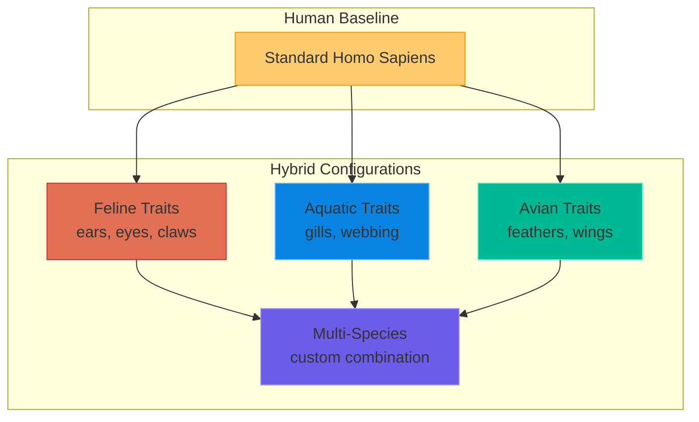

# Somatic Customization: The Mutable Body

> **"In Level 4, the body is an interface, not a cage."**

---

## Overview

**Somatic Customization** refers to intentional modification of the physical body through resonant manifestation. Unlike Level 3 methods (surgery, gene editing, pharmaceuticals), Level 4 customization is:

- **Reversible** (any change can be undone)
- **Gradual or instant** (depending on coherence level)
- **Self-directed** (no external practitioner required)
- **Non-invasive** (no cutting, injection, or genetic modification)

---

## Categories of Modification

### Tier 1: Structural Parameters (𝕄 > 0.65)

| Parameter | Range | Duration | Notes |
|:----------|:------|:---------|:------|
| **Height** | ±30 cm | 6-12 months | Bone density recalibration included |
| **Weight distribution** | Arbitrary | 1-3 months | Fat/muscle ratio adjustment |
| **Skeletal proportions** | ±20% | 3-6 months | Limb length, torso ratio |
| **Musculature** | 0.5x - 3x baseline | 1-6 weeks | Hypertrophy without exercise |

### Tier 2: Surface Expression (𝕄 > 0.70)

| Parameter | Range | Duration | Notes |
|:----------|:------|:---------|:------|
| **Skin tone** | Full spectrum | Hours to days | Melanin gradient control |
| **Hair color** | Any pigment | Immediate | Root-to-tip coherent shift |
| **Hair texture** | Any pattern | 2-4 weeks | Follicle restructuring |
| **Eye color** | Any iris pigment | Hours | Melanocyte phase adjustment |
| **Facial features** | ±2 SD | 1-3 months | Bone and soft tissue |

### Tier 3: Novel Morphology (𝕄 > 0.85)

| Modification | Complexity | Duration | AFT Pro Required |
|:-------------|:-----------|:---------|:-----------------|
| **Additional digits** | Low | 1 month | No |
| **Tail (prehensile)** | Medium | 3-6 months | Yes |
| **Wings (non-functional decorative)** | Medium | 3-6 months | Yes |
| **Wings (functional flight)** | Extreme | 1-2 years | Yes + Anchor consensus |
| **Gills (aquatic respiration)** | High | 6-12 months | Yes |
| **Bioluminescence** | Medium | 1-3 months | Yes |
| **Chromatophores (color shifting)** | High | 6 months | Yes |

### Tier 4: Cross-Species Traits (𝕄 > 0.90)

| Species Source | Adoptable Trait | Complexity | Notes |
|:---------------|:----------------|:-----------|:------|
| **Feline** | Retractable claws, night vision, ear shape | Medium | Popular aesthetic |
| **Canine** | Enhanced olfaction, tail, dentition | Medium | Sensory enhancement |
| **Avian** | Feathers, hollow bones, wing structure | High | Flight requires 𝕄 > 0.92 |
| **Aquatic** | Gills, webbed digits, lateral line | High | Full amphibian mode |
| **Reptilian** | Scales, thermal regulation, limb regeneration | Medium | Regeneration is Tier 3 |
| **Cephalopod** | Chromatophores, additional limbs, camouflage | Extreme | Most complex biomimicry |

---

## The Ethics Framework

### Self-Determination Principle

> **"Your body. Your interface. Your choice."**

In Level 4, no external authority governs what you do with your own soma. The only constraints are:

1. **Coherence thresholds** (you must have sufficient 𝕄 to stabilize the change)
2. **Handover integrity** (changes must be stable enough to persist)
3. **Non-harm** (modifications that inherently harm others are blocked)

### Age Considerations

| Life Stage | Autonomy Level | Notes |
|:-----------|:---------------|:------|
| Pre-coherence (< 7 years) | Parental guidance | Changes limited to healing/correction |
| Early training (7-14) | Supervised | Reversible modifications only |
| Coherent autonomy (14+) | Full self-determination | All tiers available based on 𝕄 |

### Reversibility Guarantee

Every somatic modification includes a **baseline anchor**—a coherent record of your original configuration. You can always return to baseline at will.

```
Reversion_time ≈ Modification_time × 0.5
```

(Undoing takes about half as long as the original change)

---

## Common Modifications

### Aesthetic (Vanity)

| Modification | Popularity | Typical 𝕄 | Duration |
|:-------------|:-----------|:----------|:---------|
| Height optimization | Very high | 0.65 | 6-12 months |
| Skin tone shift | High | 0.70 | Days |
| Age reversal (appearance) | Very high | 0.80 | 3-6 months |
| Symmetry correction | High | 0.68 | 1-2 months |
| Scar removal | Very high | 0.60 | Days |
| Body contouring | High | 0.65 | 1-3 months |

### Functional Enhancement

| Enhancement | Purpose | Typical 𝕄 | Duration |
|:------------|:--------|:----------|:---------|
| Enhanced vision | UV/IR spectrum access | 0.78 | 1-3 months |
| Auditory range | Ultrasonic/infrasonic | 0.75 | 1-3 months |
| Olfactory boost | Molecular detection | 0.80 | 2-3 months |
| Strength increase | 2-5x baseline | 0.72 | 1-2 months |
| Endurance optimization | Marathon-level baseline | 0.70 | 1 month |
| Cold/heat tolerance | Expand survival range | 0.75 | 2-3 months |

### Species Hybridization



---

## Process

### Standard Modification Protocol

1. **Define intent** — Precisely specify desired outcome
2. **Check threshold** — Verify 𝕄 meets minimum for modification type
3. **Anchor baseline** — Store current configuration for potential reversion
4. **Initiate gradient** — Begin gradual field adjustment
5. **Monitor coherence** — Ensure stability throughout transition
6. **Lock configuration** — Handover new state as stable

### Emergency Reversion

If a modification destabilizes (coherence drops below threshold):

```
Emergency_Revert = baseline_anchor × (1 - 𝕄_current)
```

The system automatically rolls back to the last stable state.

---

## Limitations

| Constraint | Reason |
|:-----------|:-------|
| **Cannot be used on others without consent** | Coherence requires aligned intent |
| **Cannot create inherently harmful configurations** | Weapons/toxins blocked by 𝕄 incompatibility |
| **Cannot exceed structural physics** | 10m height = structural collapse |
| **Cannot violate identity continuity** | Complete species change requires Level 5.0 |

---

## Social Implications

### Identity Fluidity

In Level 4, physical appearance becomes as mutable as clothing in Level 3. Implications:

| Level 3 Assumption | Level 4 Reality |
|:-------------------|:----------------|
| Appearance = identity | Appearance = current expression |
| Race = genetic ancestry | Race = chosen aesthetic (or irrelevant) |
| Age = chronological years | Age = cosmetic choice |
| Gender = birth assignment | Gender = moment-to-moment preference |
| Species = fixed | Species = gradient spectrum |

### "Original" Fetishism

Some will choose to maintain human baseline as aesthetic preference. This is valid—not mandatory modification.

### Recognition Systems

Traditional identification (face recognition, biometrics) becomes unreliable. Level 4 uses **coherence signatures**—your unique 𝕄 pattern, which persists across visual changes.

---

## Costs

| Modification Tier | Energy Cost | Time Investment | AFT Pro |
|:------------------|:------------|:----------------|:--------|
| Tier 1 (Structural) | Low | Months | No |
| Tier 2 (Surface) | Very Low | Days-Weeks | No |
| Tier 3 (Novel) | Medium | Months | Yes |
| Tier 4 (Cross-Species) | High | Months-Years | Yes |

There is no monetary cost—energy comes from internal coherence, not external extraction.

---

## FAQ

**Q: Can I look like a specific other person?**  
A: Technically yes, but identity coherence signatures remain unique. You cannot *be* them—only visually resemble them.

**Q: Can I become non-humanoid?**  
A: Quadruped, serpentine, and other body plans are possible at Tier 4. Full non-human transition is Level 5.0 territory.

**Q: Is this permanent?**  
A: Only if you want it to be. Baseline anchor ensures reversibility.

**Q: What about internal organs?**  
A: Organ enhancement falls under [Bio-Augmentation](./BIO_AUGMENTATION_SPECS.md), which covers longevity, immune system, and metabolic optimization.

**Q: Can I give myself wings that actually fly?**  
A: At 𝕄 > 0.92, yes. Requires Anchor consensus because of the structural physics involved. Most pursue decorative wings first.

---

*© 2026 cr8OS Foundation / Aevov Research*
